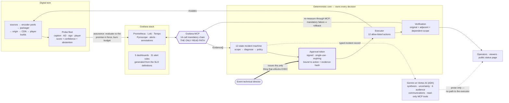

# Raccord

**Accessible Experience Reliability for live media.**
A stream is not healthy unless every promised accessibility experience is healthy.

> **Agentic Cinema — Grafana track.**
> Raccord certifies, monitors, diagnoses, repairs and *proves* the accessibility of a live
> media experience. It investigates through the **official Grafana MCP server**, reasons with
> **Gemini on Google Cloud via the Agent Development Kit**, and closes every incident with a
> re-measurement rather than an opinion.
>
> **1,000 benchmarked scenarios · detection 1.000 · scope precision 1.000 · recovered and
> verified 0.919 · false closures 0.001 · unsafe actions 0.000 · WCAG 2.2 AA.**

---

## The problem

Media reliability systems declare a stream healthy when the picture and the primary audio are
online. By that definition a stream is "healthy" while:

- captions are eight seconds behind the dialogue on two connected-TV builds in Western Europe,
- the described-audio track is declared in the manifest but carries silence,
- the sign-language interpreter is frozen on one repeated frame,
- the caption menu has a keyboard trap, so a keyboard-only viewer cannot turn captions on at all.

Every one of those is total loss of service for the viewers who depend on it, and none of them
moves a conventional availability dashboard. Nobody is paged. The error budget does not burn.
The incident is discovered from social media, an hour later, by which time a live premiere is
over.

Raccord treats captions, audio description, alternate-language audio, sign-language video,
accessible playback controls, accessible authentication and accessible purchase as
**production services with SLOs, error budgets, owners, incident procedures and proof of
recovery**.

## What it does

| Mode | What happens |
|---|---|
| **Preflight certification** | Every promise the event made is tested against the real chain and real players before the event may say "accessibility ready". Hard assertions block certification. Output is a signed record. |
| **Live assurance** | The probe fleet measures the *rendered* experience across the language × territory × platform × device × build matrix and evaluates it against the promise that was in force at that moment. |
| **Closed-loop incident response** | Detect → scope → gather evidence through Grafana MCP → diagnose → evaluate policy → obtain a signed approval → execute one allow-listed action → re-measure → communicate → review. Twelve states, no skipping. |
| **Reliability intelligence** | Post-incident measurement of what was missed, which change caused it, how much error budget it cost, and which improvements to propose to a human. |

### One control plane, live and on demand

The same loop runs a global premiere and a back catalogue. Every one of the 31 SLOs is defined
per tier — `tier0_global_live`, `tier1_regional_live`, `tier2_vod_premium`, `tier3_catalog` —
with its own objective and its own error budget (1, 3, 10 and 30 minutes respectively), and the
policy engine reads **tier and liveness independently**. Rule P-010 demands a signed approval
from the technical director for anything touching a live tier-0 chain. Rule P-020 lets a narrow,
reversible, single-region recovery run **automatically** when the content is not live.

That second path is where the volume is. You can put a human in the loop for one premiere. You
cannot put a human in the loop for a fifty-thousand-title catalogue — which is exactly where
accessibility rot accumulates: the described-audio track that has been silent for eight months,
on a film nobody watches with description except the people who cannot watch it without.

**This is now a legal obligation, not a courtesy.** The European Accessibility Act has been
applicable to audiovisual media services since June 2025; the FCC enforces caption-quality
rules; Ofcom sets access-service quotas. Broadcasters demonstrate compliance today with periodic
sampling and a spreadsheet. Raccord turns it into a continuously measured objective with a
hash-chained evidence trail per incident — the same artifact that satisfies an auditor also
pages an engineer.

---

## Run it

The full demonstration runs **with no credentials, no cloud account and no network**.

```bash
git clone https://github.com/Marc-Dvci/Raccord.git && cd Raccord
python -m venv .venv && . .venv/bin/activate      # Windows: .venv\Scripts\activate
pip install -e ".[dev]"

raccord hero        # the closed loop, in the terminal, ~30 seconds
raccord serve       # the product, at http://localhost:8080
```

`raccord hero` injects a documented fault into the digital twin and runs the whole loop,
printing the Grafana MCP call chain and the public status update it generated.

Evaluating rather than exploring? **[docs/JUDGE.md](docs/JUDGE.md)** walks the whole system in
ten minutes, offline.

### With the real Grafana stack

```bash
docker compose up -d                    # Grafana, Prometheus, Loki, Tempo, Pyroscope
./tools/grafana_token.sh                # mints a service-account token into .env
docker compose --profile mcp up -d mcp-grafana    # the official grafana/mcp-grafana server

# .env
RACCORD_MCP_TRANSPORT=http
RACCORD_MCP_HTTP_URL=http://localhost:8000/mcp
RACCORD_EXPORT_TELEMETRY=true                # push probes, logs, spans and annotations into the stack

pip install -e ".[cloud]"               # the MCP SDK
raccord serve                       # Prometheus scrapes /metrics; the agent reads via MCP
open http://localhost:3000              # admin / raccord — five provisioned dashboards
```

Inject a fault and run the loop; every fact now comes from a real Grafana:

```bash
curl -X POST localhost:8080/api/inject -H 'content-type: application/json' \
     -d '{"fault_id":"cap.progressive_drift","ticks":10,"seconds_per_tick":20}'
curl -X POST 'localhost:8080/api/incident/run?auto_approve=true'
```

No agent code changes. The client discovers the server's real tool list, resolves the
capabilities it needs against it, and refuses to start an investigation it cannot fully evidence.

```bash
python tools/mcp_conformance.py --transport http --out docs/mcp_conformance.json
# 65 tools advertised · 18/20 capabilities resolved · 12/12 required
```

**The whole closed loop runs against the official `grafana/mcp-grafana:1.0.0` server** — every MCP call
successful, ending `REVIEWED` with 9/9 assertions and scope 1.00/1.00, against a real Grafana
reading real Prometheus, Loki and Tempo. The alert that opened it was a real Grafana alert rule
in `firing` state. Artifact: [`docs/real_mcp_run.json`](docs/real_mcp_run.json).

That works because Raccord binds to *capabilities*, not tool names. The official server has
renamed, consolidated and removed tools over its releases: alert listing and retrieval are now
one action-dispatch tool, and current open-source builds reach Tempo through the generic
`grafana_api_request` against Grafana's datasource proxy — still over MCP, still audited.
`src/raccord/grafana_mcp/adapters.py` carries one adapter per deviating tool — argument
translation, discovered datasource UIDs, Grafana-native time formats, response normalisation —
and 19 tests pin those shapes, so a server-side change surfaces as a named test failure rather
than a dead investigation. Full measurement:
**[docs/MCP_CONFORMANCE.md](docs/MCP_CONFORMANCE.md)**.

### With Gemini

```bash
# .env
RACCORD_REASONING_MODE=gemini
GOOGLE_GENAI_USE_VERTEXAI=TRUE
GOOGLE_CLOUD_PROJECT=<project>
pip install -e ".[cloud]"
```

---

## Architecture

Two properties carry the whole design, and both are visible here: **every fact enters through
Grafana MCP**, and **nothing changes production without a signed human approval**.



Full version, with the trust boundaries and the cloud footprint:
**[docs/ARCHITECTURE.md](docs/ARCHITECTURE.md)**.

---

## How Grafana is load-bearing

This is not a project that renders a chart in Grafana at the end. **Grafana MCP is the agent's
only route to operational truth**, and the state machine enforces it: the transition into
`EVIDENCE_COMPLETE` has a machine-checkable precondition requiring evidence whose `source_tool`
is a Grafana MCP tool for alerts, metrics, logs, traces *and* dashboards.

```python
# src/raccord/incident.py
REQUIRED_EVIDENCE_TOOLS = (
    "grafana.mcp:list_alert_rules",
    "grafana.mcp:query_prometheus",
    "grafana.mcp:query_loki_logs",
    "grafana.mcp:query_tempo_traces",
    "grafana.mcp:search_dashboards",
)
```

Delete the MCP server and the incident cannot leave `SCOPED`. There is no fallback path that
queries Prometheus, Loki or Tempo directly — a test asserts that every evidence item in a
completed incident came through MCP (`tests/test_mcp_and_loop.py`).

**The mandatory chain**, in order, for the hero incident:

| # | Capability | What it establishes |
|---|---|---|
| 1 | `list_alert_rules` | which accessibility rule is firing |
| 2 | `get_alert_rule_by_uid` | the rule's objective, labels and runbook |
| 3 | `query_prometheus` | the breached SLI across the slice matrix |
| 4 | `query_prometheus` | k-anonymised accessibility-enabled session aggregates |
| 5 | `find_annotations` | deployments and configuration changes in the window |
| 6 | `query_loki_logs` | encoder-pool logs for the implicated component |
| 7 | `query_loki_logs` | the timing-reference daemon's log |
| 8 | `query_tempo_traces` | the media path through the affected pool |
| 9 | `search_dashboards` | the dashboard a human should open |
| 10 | `generate_deeplink` | a reviewable link scoped to the incident window |
| 11 | `create_incident` | declares it in Grafana |
| 12 | `add_activity_to_incident` | the approved action on the Grafana timeline |
| 13 | `query_prometheus` | the recovery series, read back before closing |
| 14 | `create_annotation` | the recovery annotation |

Fourteen mandatory steps, plus conditional calls for trace fallback, incident reconciliation and
dashboard annotation — 16.9 calls per incident across the benchmark. Full detail with request
and response shapes: **[docs/MCP_CALL_CHAIN.md](docs/MCP_CALL_CHAIN.md)**.

Everything Raccord learns also *becomes* Grafana data: Prometheus series for every probe
finding, SLO evaluation and session aggregate; Loki lines from every delivery component; Tempo
spans for the media path **and for the agent's own reasoning**; Pyroscope profiles for the probe
fleet. Five dashboards and 31 alert rules are generated from the SLO definitions
(`tools/generate_grafana_assets.py`), so a panel threshold can never drift from the objective
the probes are measured against — CI fails if it does.

## How Gemini and Google Cloud are load-bearing

Narrow deterministic specialists run the governed incident workflow under a twelve-state machine
with typed contracts at every boundary. **Gemini on Vertex AI** takes the typed incident record
after deterministic diagnosis and does what a frontier model
is uniquely good at: reading a multimodal picture across metrics, logs, traces, probe findings
and change events; naming what is uncertain and which evidence would resolve it; and writing six
audience-specific communications — operator, accessibility specialist, technical director, viewer
support, executive and public status — each in the right register and reading level. It reaches
the read-only Grafana MCP tool surface through ADK's `McpToolset`, so an operator's follow-up question
pulls fresh evidence through the same governed path. After verified closure, a separate learning
skill proposes falsifiable reliability experiments while preserving the deterministic root cause.

**This is agent architecture built to production standards.** The measurement, policy and
verification arithmetic is typed, tested code, and `RemediationExecutor` accepts only a redeemed,
single-use, HMAC-signed approval token bound to an exact action hash and evidence hash. That
separation is what makes an autonomous agent deployable against a live premiere: the system is
free to reason expansively because the blast radius of a wrong conclusion is a proposal a human
declines, not an outage. It is also why the unsafe-action rate is 0.000 across 1,000 scenarios.

Google Cloud: Gemini on Vertex AI, ADK for the managed reasoning dispatcher and MCP toolset,
Agent Engine for the reasoning runtime (`tools/deploy_agent_engine.py`), Cloud Run for the app,
Pub/Sub for de-identified live summaries, BigQuery and immutable Cloud Storage incident evidence,
and Secret Manager plus IAM for the security boundary. These are provisioned and wired by
Terraform; none is a slide-only component. See **[docs/ARCHITECTURE.md](docs/ARCHITECTURE.md)**.

---

## The hero incident

A global film-festival premiere is live. Picture and primary audio are perfect. A PTP
grandmaster failover moves the caption chain onto an NTP fallback, and English captions on two
connected-TV builds in Western Europe drift progressively to eight seconds behind the dialogue.

```
$ raccord hero
baseline healthy: 0 SLOs breaching

╭─ fault injected ─────────────────────────────────────────────╮
│ Progressive caption drift                                    │
│ ground truth: caption.progressive_drift                      │
╰──────────────────────────────────────────────────────────────╯
breaching now: ['cap.drift', 'cap.omission_rate', 'cap.speaker_accuracy']

detected                        yes
diagnosis                       yes (0.683 posterior)
state                           REVIEWED
scope                           DE/ES/FR/GB · ctv-9.3.1/ctv-9.4.0 · en
scope precision/recall          1.00 / 1.00
policy                          approval_required
approval                        t.duval@studio.example (event_technical_director)
action                          select_synchronized_standby
verification                    9/9 assertions passing
recovered                       yes
sessions affected / protected   8,053 / 140,295
Grafana MCP calls               17
unsafe action                   no
audit chain                     yes
```

The system localised the fault to exactly the four Western European territories, the two CTV
builds and the English track — **precision and recall 1.00** against a fault specification the
agents never see. It separated a progressive drift from a fixed clock offset by the *shape* of
the SLI across the window rather than its magnitude, and correlated it to the PTP grandmaster
failover that caused it.

Then it governed the fix. The event is tier-0 and live, so policy required a signed token from
the technical director before anything moved. The incident closed only after nine assertions
passed — including *adjacent* checks proving French, German and Spanish captions, the described
audio and the interpreter feed were not regressed by the repair. Thirty seconds, end to end,
with a hash-chained audit trail of every state transition.

---

## Benchmark

1,000 seeded scenarios drawn from a library of 45 documented faults across every accessibility
feature. The agents never see the fault specification; the harness scores against it.

Run: `raccord bench --scenarios 1000` · results: [`bench/results/summary.json`](bench/results/summary.json)
· methodology and full numbers: **[docs/BENCHMARK.md](docs/BENCHMARK.md)**.

Published run: 1,000 scenarios, 45 fault types, seed 20260803.

| Metric | Result |
|---|---|
| Detection rate | **1.000** |
| Scope precision / recall | **1.000 / 0.993** |
| Top-1 root cause | 0.652 |
| Top-3 root cause | 0.897 |
| Corrective action chosen | 0.895 |
| Recovered **and verified** | 0.919 |
| Rolled back after failed verification | 0.081 |
| **False closure rate** | **0.001** |
| **Unsafe action rate** | **0.000** |
| Mean Grafana MCP calls per incident | 16.9 |

**The two numbers near zero are the ones that make this deployable.** A false closure —
declaring an accessibility feature restored when it is not — is the failure mode that makes an
automated system worse than no system. It happens once in a thousand scenarios, because closure
is gated on re-measurement through Grafana rather than on a model's confidence. And in the 10.5%
of cases where the system selects a suboptimal action, verification catches it and rolls back
automatically instead of closing the incident.

**Ablations** quantify what each component contributes: removing change correlation costs 13.0
points of top-1 accuracy and 15.5 of recovery; removing the scope agent halves scope precision
from 1.000 to 0.494. Every configuration is scored over the same 200 scenarios.
[docs/BENCHMARK.md](docs/BENCHMARK.md) has the full methodology, the per-feature breakdown, the
difficulty stratification and the ablation tables.

---

## The product

`raccord serve` is an operational product, not a chat window:

- **Overview** — global accessible-experience map, promise registry, error budgets, fault library
- **Readiness studio** — every preflight assertion with result, evidence, owner and blocker list
- **Live cockpit** — audience experience, telemetry, environment state and delivery logs
- **Incident workspace** — evidence, ranked diagnosis, change correlation, policy, approval,
  verification, communications and the hash-chained audit trail, each visually and structurally
  separated so that *evidence*, *hypothesis*, *policy* and *verified result* are never confused
- **Ask the agent** — interrogate the diagnosis in place. *Why did you rule out a fixed clock
  offset? What changed just before this started? How do you know it is actually fixed?* Every
  answer cites the evidence it rests on and the Grafana MCP tool that produced it, and with the
  Gemini plane configured a question the retrieved evidence cannot settle sends the agent back
  to Grafana MCP for more — the same audited path, visible as new calls in the Agent & MCP view
- **Evidence replay** — the exact affected interval: what was spoken against what was captioned
- **Agent & MCP observability** — every tool call, latency, capability resolution and agent step
- **Benchmark laboratory** — the measured results, in the product

The UI is dependency-free — no framework, no bundler, no CDN, nothing loaded from a third-party
host — and conforms to **WCAG 2.2 AA**: keyboard-operable throughout, status never conveyed by
colour alone, reflow to 320 CSS pixels, correct language of parts across five languages.
`python tools/a11y_audit.py` enforces it with 63 automated checks and CI fails the build on any
regression; `python tools/capture_screenshots.py` drives all seven views in a real browser and
records **zero console errors and zero warnings**. See
**[docs/ACCESSIBILITY_CONFORMANCE.md](docs/ACCESSIBILITY_CONFORMANCE.md)**.

---

## Repository map

```
src/raccord/
  contracts.py        typed records for every agent/tool/storage boundary + the state graph
  registry.py         versioned accessibility promise registry (point-in-time reads)
  twin.py             the digital twin: versioned topology graph + blast-radius traversal
  media.py            "The Lumière Protocol" — original programme, dialogue, scenes
  simulator.py        the instrumented delivery chain; faults change what audiences receive
  faults.py           45 documented faults — the benchmark's ground truth, read by nothing else
  probes/             caption, audio-description, sign-feed and player probes + alignment
  probes/accelerated/ wavefront, Triton and CUDA alignment kernels — bit-identical to the
                      reference, 9.9× faster at 1024 tokens (docs/PERFORMANCE.md)
  slo.py              31 SLOs with per-tier objectives and error budgets — the source of truth
  assurance.py        sweep → SLO evaluation → error-budget burn → structured alerts
  incident.py         the 12-state machine, preconditions, hash-chained audit, persistence
  policy.py           policy as code (12 rules) + the 12-action allow-list catalog
  approvals.py        signed, single-use, expiring approval tokens
  executor.py         the only component permitted to change the environment
  verification.py     post-action assertion suites (original / adjacent / dependent scope)
  certification.py    the Accessibility Release Gate
  grafana_mcp/        MCP client: capability resolution, stdio/http transports, in-process server
  agents/             coordinator, scope, evidence, quality, correlation, diagnosis,
                      communication, learning + the Gemini/ADK reasoning plane
  telemetry.py        metrics, logs, traces, profiles, Grafana annotations and incidents
  api.py, web/        the product
observability/        docker-compose stack config, provisioned datasources, generated
                      dashboards and 31 alert rules
bench/                the benchmark harness, the probe calibration study, and their results
tools/                asset generation, accessibility audit, SBOM, MCP conformance,
                      headless-Chrome screenshot + console capture, Agent Engine deployment
ebpf/                 delivery-path kernel telemetry, correlated to media symptoms
infra/terraform/      Cloud Run, Agent Engine IAM, Secret Manager, GCS evidence, Pub/Sub and
                      BigQuery — the trust boundary as code
docs/                 architecture, MCP chain, benchmark, performance, threat model, privacy,
                      accessibility conformance, model and dataset cards, media rights, ADRs,
                      demo script, judge instructions
```

## Documentation

| | |
|---|---|
| **[JUDGE.md](docs/JUDGE.md)** | **evaluate the whole system in ten minutes, offline — start here** |
| [ARCHITECTURE.md](docs/ARCHITECTURE.md) | the whole system, the trust boundaries, the cloud footprint |
| [CLOUD_DEPLOYMENT.md](docs/CLOUD_DEPLOYMENT.md) | secure, project-pinned Google Cloud and Grafana Cloud release runbook |
| [MCP_CALL_CHAIN.md](docs/MCP_CALL_CHAIN.md) | every Grafana MCP call, why it is made, what it returns |
| [MCP_CONFORMANCE.md](docs/MCP_CONFORMANCE.md) | the official server's tool surface, measured, and how Raccord binds to it |
| [BENCHMARK.md](docs/BENCHMARK.md) | methodology, results, ablations |
| [PERFORMANCE.md](docs/PERFORMANCE.md) | the custom alignment kernels, measured — 9.9× at 1024 tokens |
| [THREAT_MODEL.md](docs/THREAT_MODEL.md) | the security boundary, and what it holds |
| [PRIVACY.md](docs/PRIVACY.md) | measuring accessibility impact without ever inferring disability |
| [ACCESSIBILITY_CONFORMANCE.md](docs/ACCESSIBILITY_CONFORMANCE.md) | the product's own WCAG 2.2 AA conformance |
| [model_card.md](docs/model_card.md) · [dataset_card.md](docs/dataset_card.md) | the measurement models and their training data |
| [MEDIA_RIGHTS.md](docs/MEDIA_RIGHTS.md) | provenance of every asset — all original |
| [DEMO_SCRIPT.md](docs/DEMO_SCRIPT.md) · [RECORDING_CHECKLIST.md](docs/RECORDING_CHECKLIST.md) | the three-minute demonstration, and how to record it |
| [screenshots/](docs/screenshots/) | the seven product views — `python tools/capture_screenshots.py` regenerates them from a live run |
| [adr/](docs/adr/) | twelve architecture decision records |
| [`sbom.json`](sbom.json) | CycloneDX software bill of materials — `python tools/generate_sbom.py` |

## Scope of this release

Raccord runs against a high-fidelity digital twin of a live delivery chain, which is what
makes 1,000 reproducible fault scenarios and exact ground-truth scoring possible. The submitted
cloud path uses the official self-hosted Grafana MCP server behind an authenticated Cloud Run
gateway; Grafana's interactive hosted-OAuth endpoint is deliberately not used by the unattended
Agent Engine runtime. Real player-edge probes remain roadmap.

## Licence

Apache-2.0. See [LICENSE](LICENSE). The demonstration programme *The Lumière Protocol* — every
line of dialogue, every scene description, every translation — is original work created for this
project and licensed under the same terms. No third-party film, script, subtitle file or
recording is used anywhere in this repository.
